# HashCredit — Hashrate-Backed Lending on Bitcoin L2

  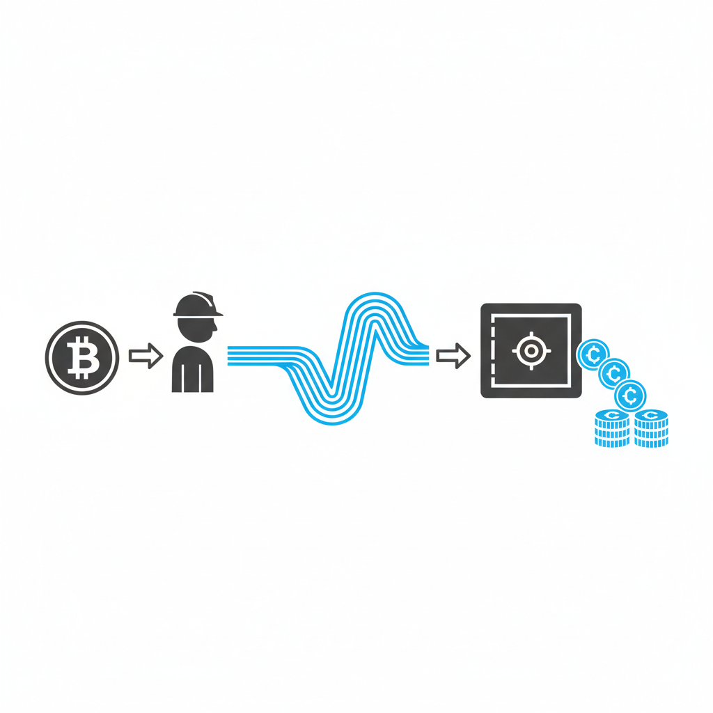

> “Don’t sell your Bitcoin. Leverage your work.”

## TL;DR (Hook in 3 lines)

- **Collateral = Proven Hashrate (future revenue), not ASICs.**
- **Verify mining-pool payouts on-chain via Creditcoin Gateway (SPV / Merkle proofs)** — no bridges, wrappers, or centralized oracles.
- **Keep BTC on Bitcoin; unlock stablecoin liquidity on Creditcoin.**

  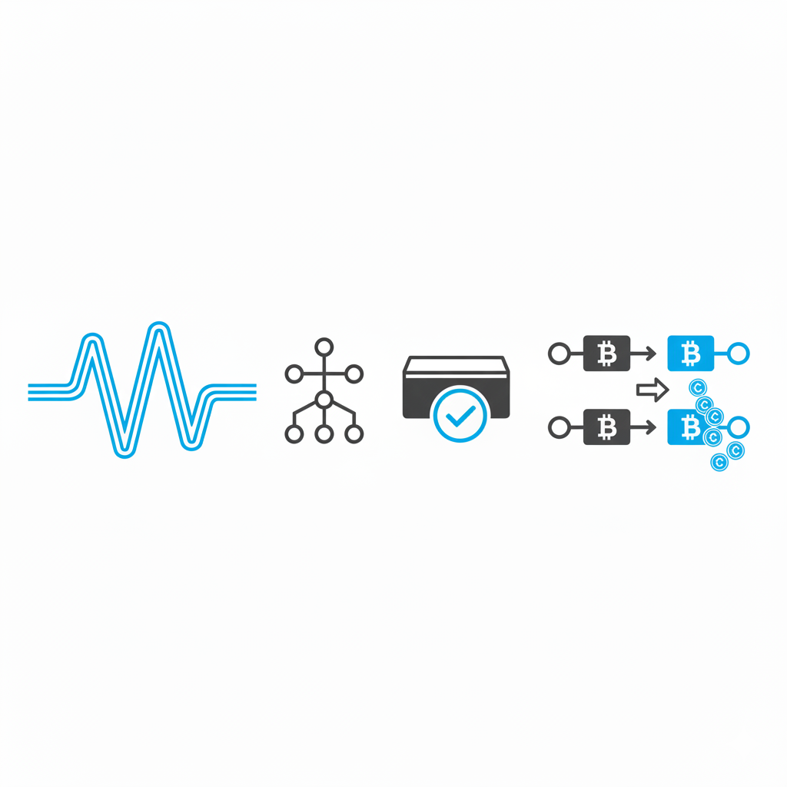

## Elevator Pitch

HashCredit is a decentralized lending protocol that allows Bitcoin miners to collateralize their **future revenue stream (hashrate)** instead of physical hardware. Using **Creditcoin’s Universal Smart Contract (USC)** and **Gateway** technology, we verify mining pool payouts directly on-chain — enabling trust-minimized underwriting for miner working capital.

  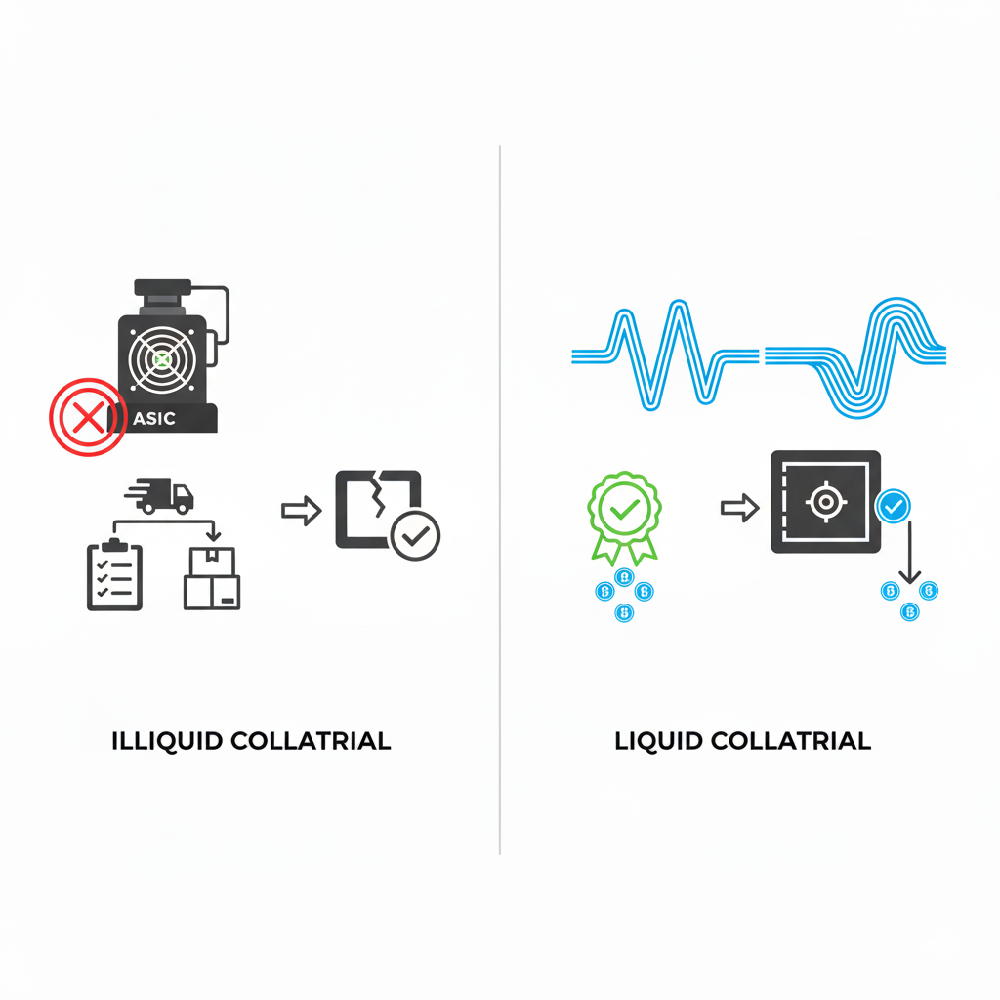

## Problem — “Rich in Iron, Poor in Cash”

Bitcoin mining is capital-intensive and trapped in a liquidity paradox:

- **Hardware illiquidity:** Miners hold millions in ASICs, but loans require physical audits, shipping logistics, and rapid depreciation checks.
- **The “HODL” dilemma:** To pay electricity (OPEX), miners sell mined BTC immediately and miss upside.
- **DeFi disconnect:** Most DeFi only accepts liquid tokens (e.g., WBTC, ETH) and ignores the value of Proof-of-Work activity itself.

  

## Solution — On-Chain Revenue-Based Financing

We treat **“proven hashrate”** as the new creditworthiness primitive:

- **No physical collateral:** Your on-chain revenue track record becomes the collateral.
- **No centralized oracle:** We don’t trust; we verify via **SPV proofs**.
- **No bridging BTC:** Keep BTC on Bitcoin; get liquidity on Creditcoin.

  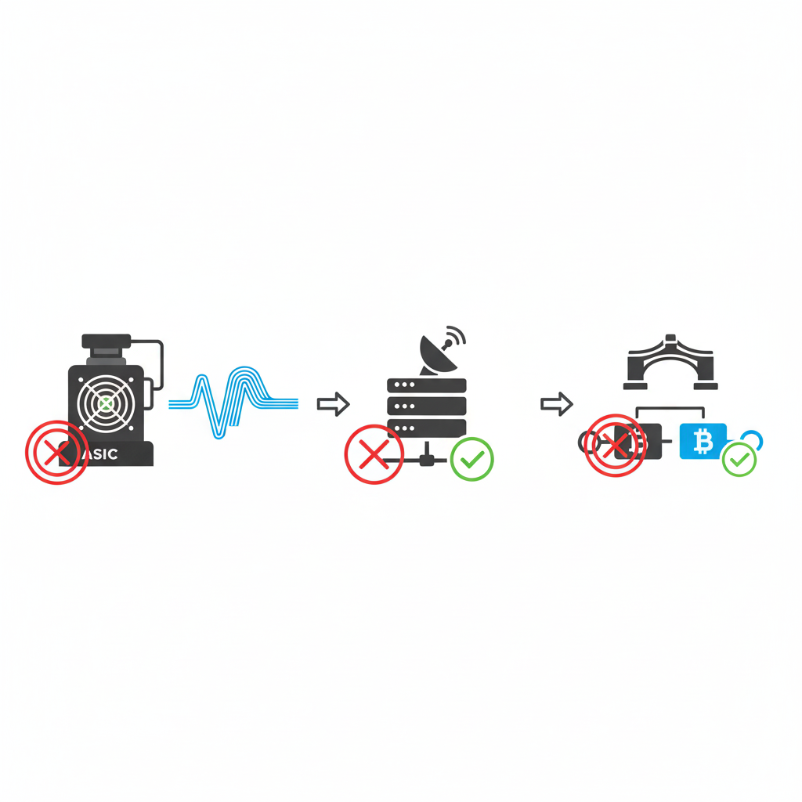

## How It Works (Tech)

HashCredit leverages **Creditcoin USC** to read Bitcoin state natively.

  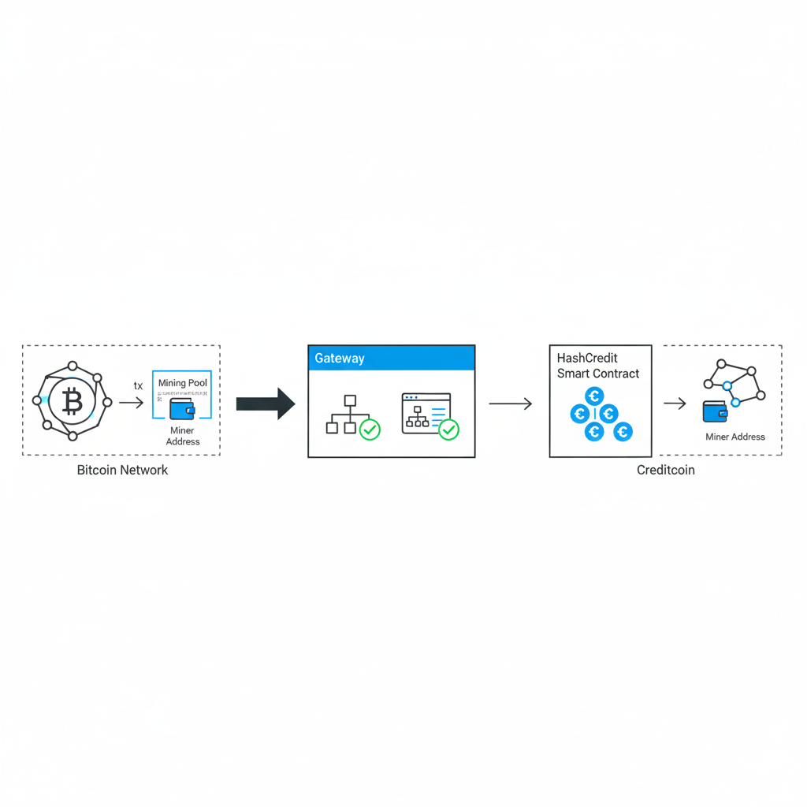

### 1) Connect & Bind

A miner registers their BTC payout address with HashCredit.

### 2) Verify Income (The “Secret Sauce”)

- Miner submits a `txid` for a payout received from a known mining pool (e.g., Foundry, AntPool).
- Creditcoin Gateway nodes verify the **Merkle proof (SPV)** against the Bitcoin block header.
- The protocol confirms on-chain: “This address received X BTC from Pool Y at Block Z.”

  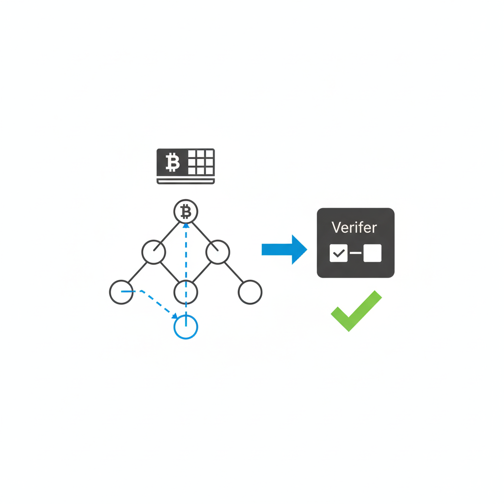

### 3) Score & Fund

- Contract estimates implied/average hashrate from payout volume + network difficulty.
- A credit line opens in stablecoins (e.g., USDC/USDT) on the Creditcoin network.

  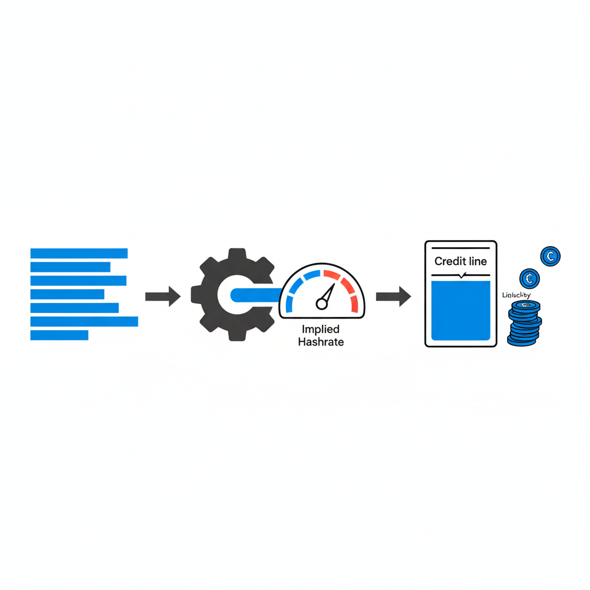

### 4) Repayment

Miner repays principal + interest to unlock higher limits and future borrowing.

  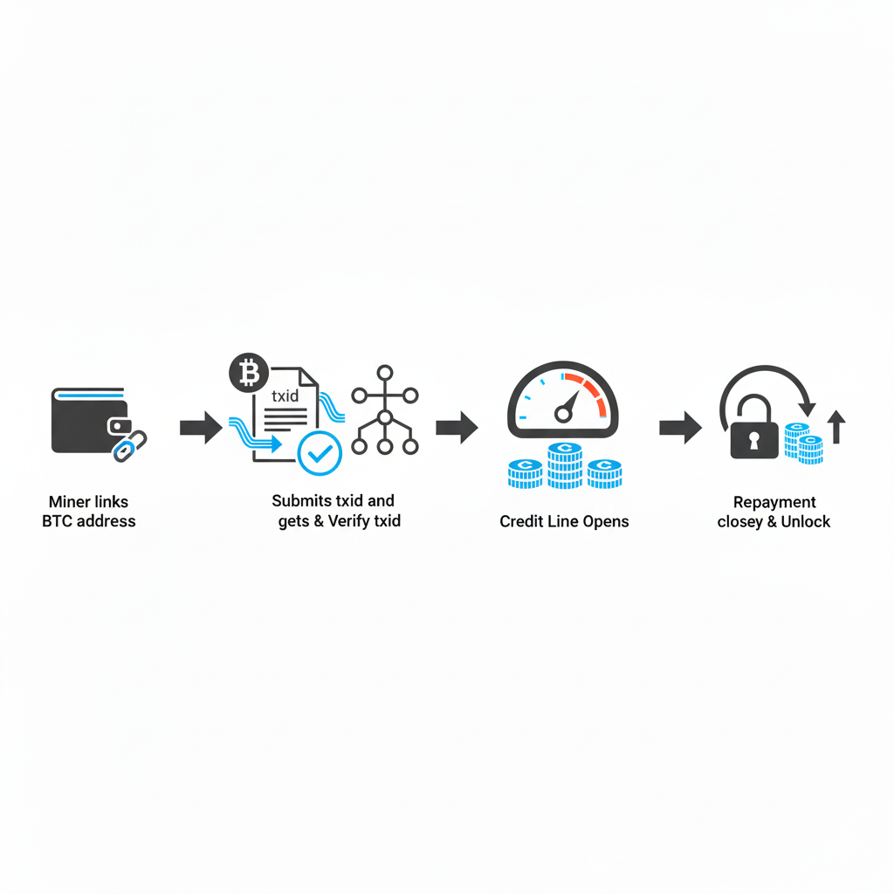

## Market Opportunity

- **Target audience:** Mid-sized mining farms & institutional miners.
- **Scale:** Bitcoin mining is a $15B+ annual revenue industry. Capturing just 0.1% of this liquidity flow creates meaningful TVL for the Creditcoin ecosystem.
- **Why now:** Post-halving margin compression makes efficient working capital existential. HashCredit directly addresses OPEX liquidity needs without forcing BTC sales.

  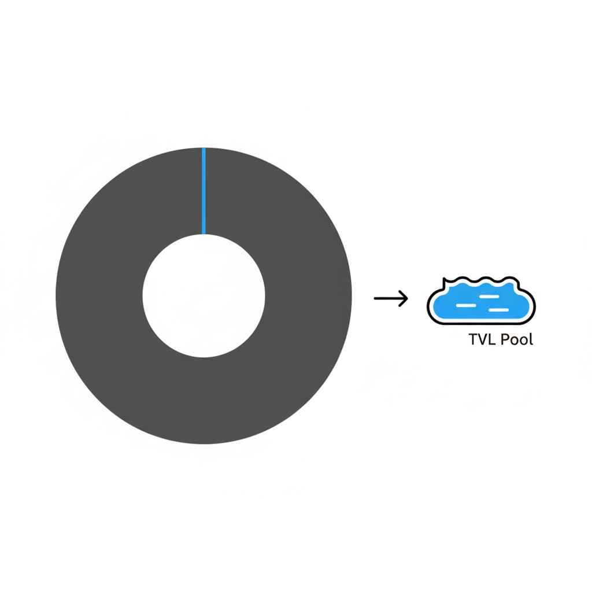

## Why Creditcoin

We didn’t just build *on* Creditcoin — we built *for* Creditcoin. HashCredit validates the Creditcoin 3.0 thesis:

> “A Universal Smart Contract that can verify cross-chain states without bridges.”

  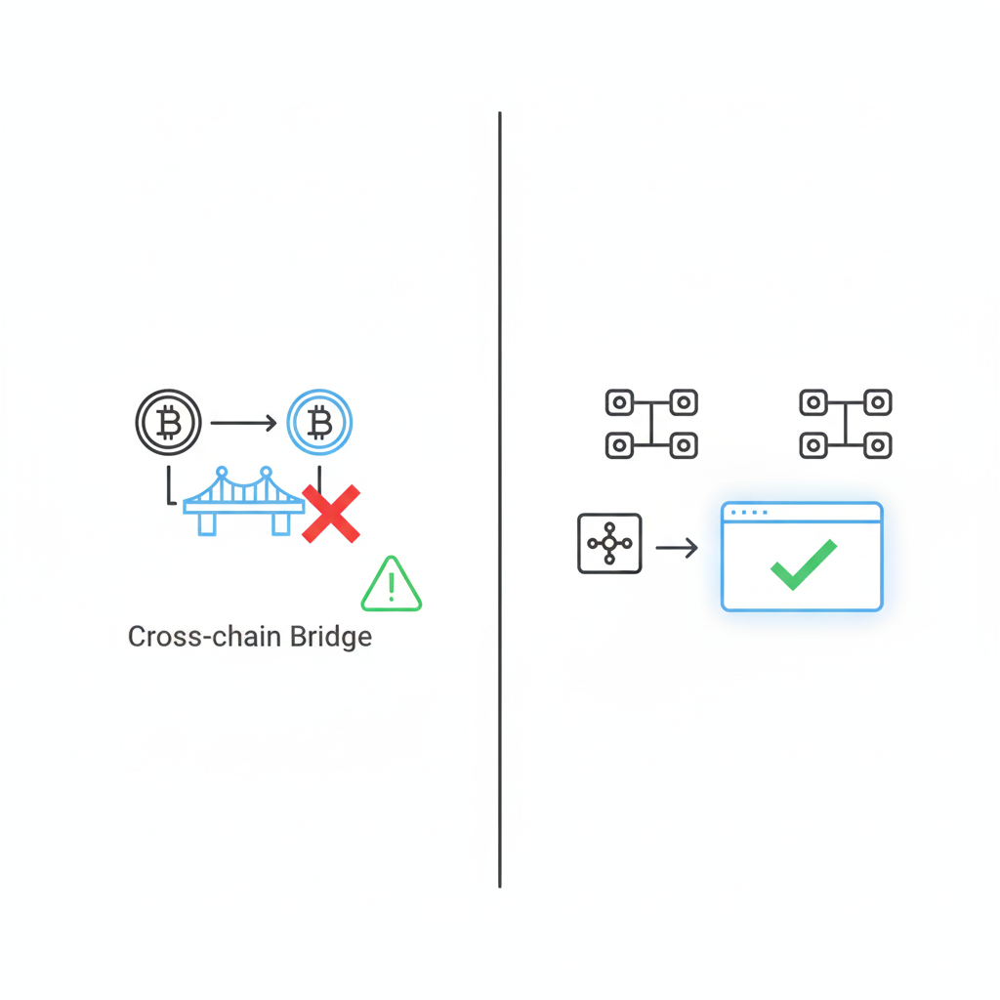

HashCredit is a concrete RWA/underwriting application of **Gateway SPV proofs**, showcasing Creditcoin as the most “Bitcoin-native” L2 for financial primitives.

## Roadmap

- **Phase 1 — Hackathon MVP**
  - Verify a Bitcoin Testnet transaction via Creditcoin USC.
  - Implement basic hashrate-to-credit calculation logic.
- **Phase 2 — Alpha**
  - Integrate top 3 mining pool payout address sets.
  - Partner with stablecoin issuers/liquidity providers.
- **Phase 3 — Mainnet**
  - DAO governance for pool whitelisting/parameters.
  - Launch “Hashrate Tokenization” (tradable yield-bearing positions).

  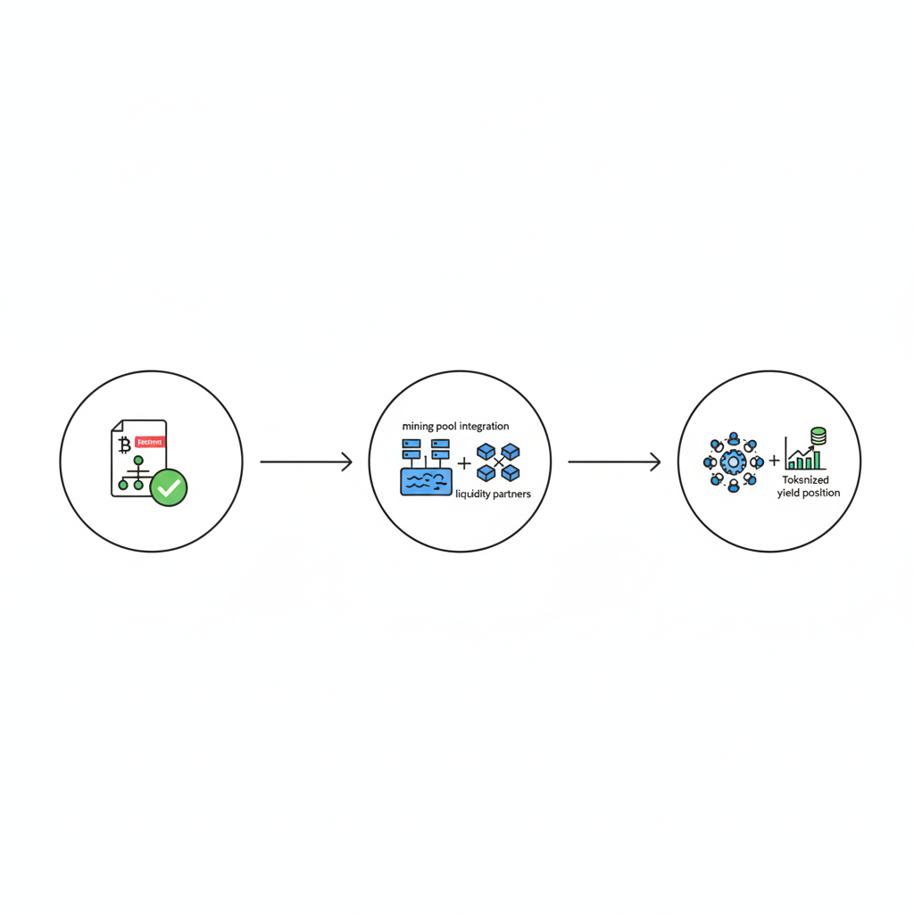

## Links & Resources

- **Demo video:** [Link]
- **GitHub:** [Link]
- **Live demo:** [Link]
