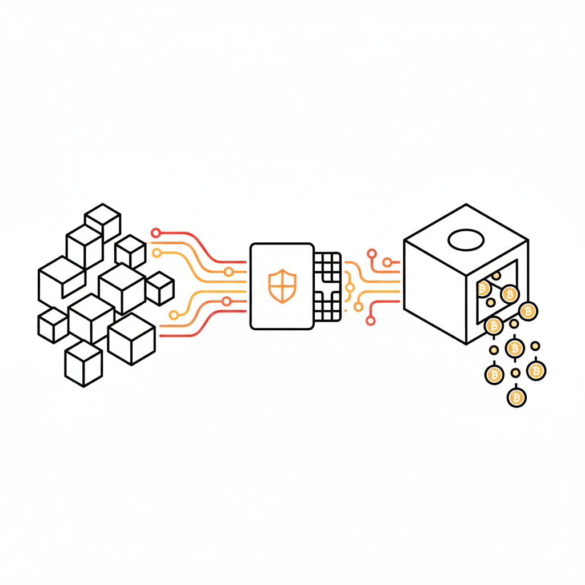
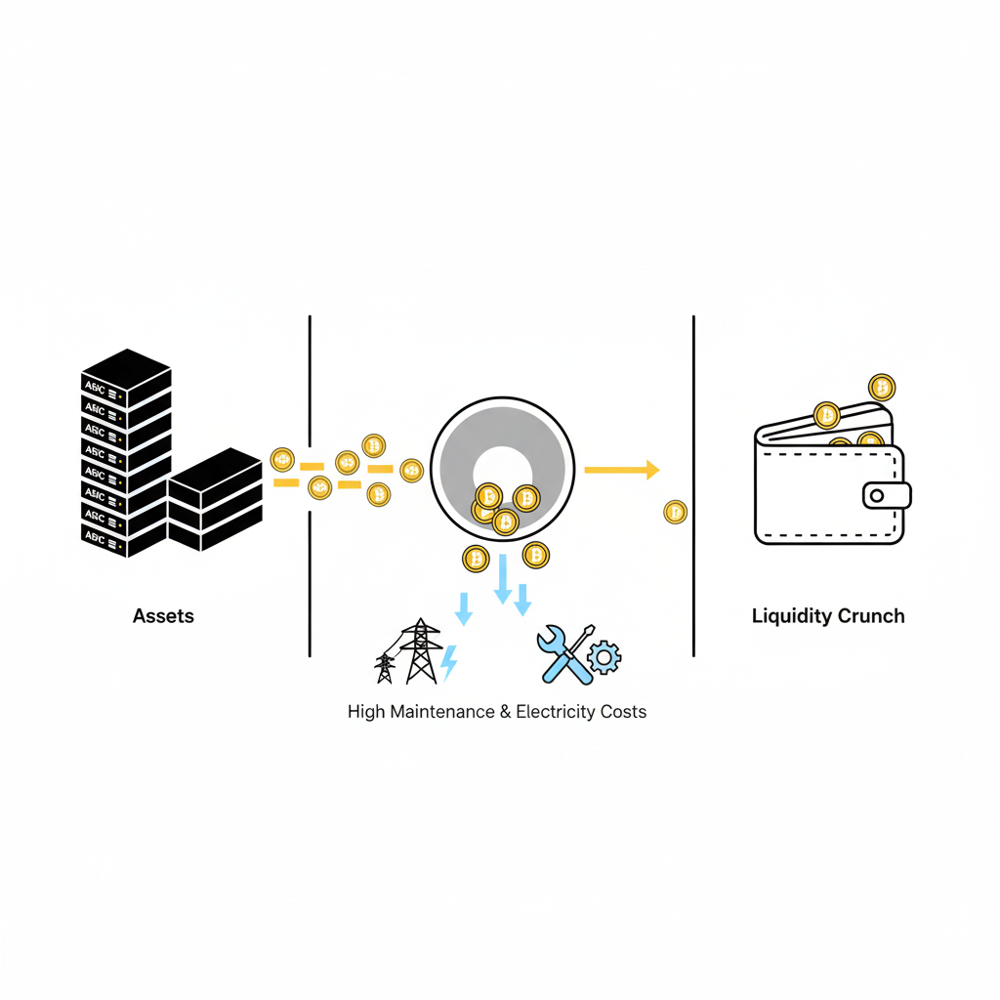
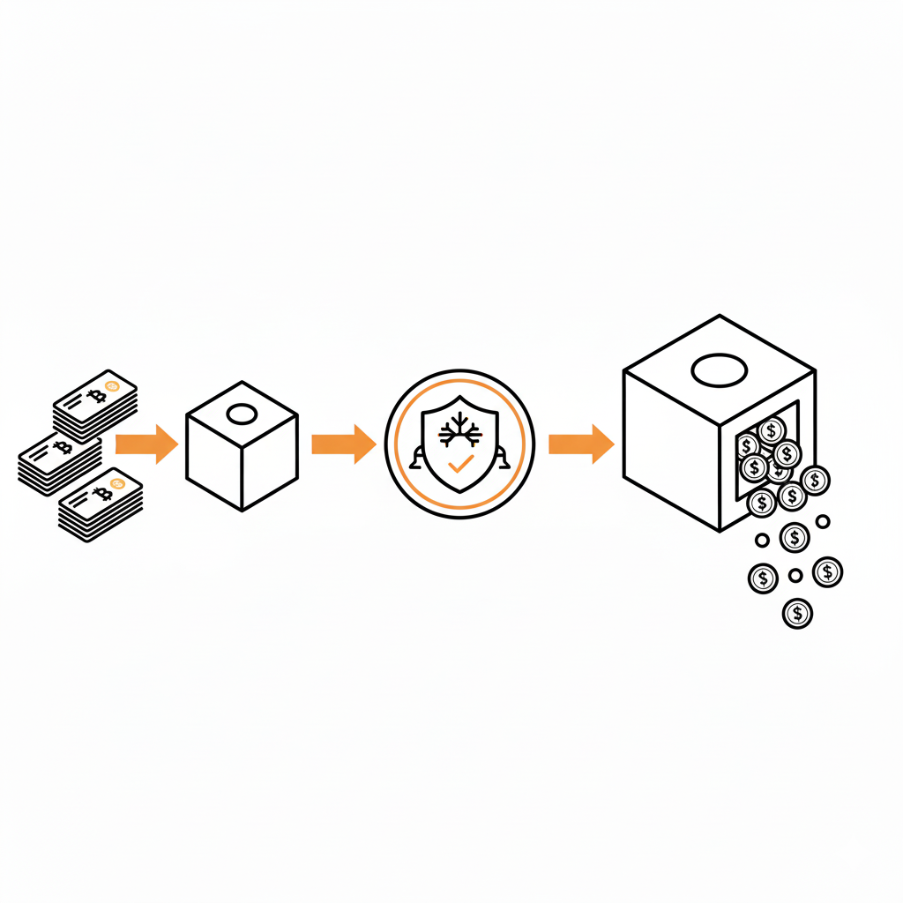
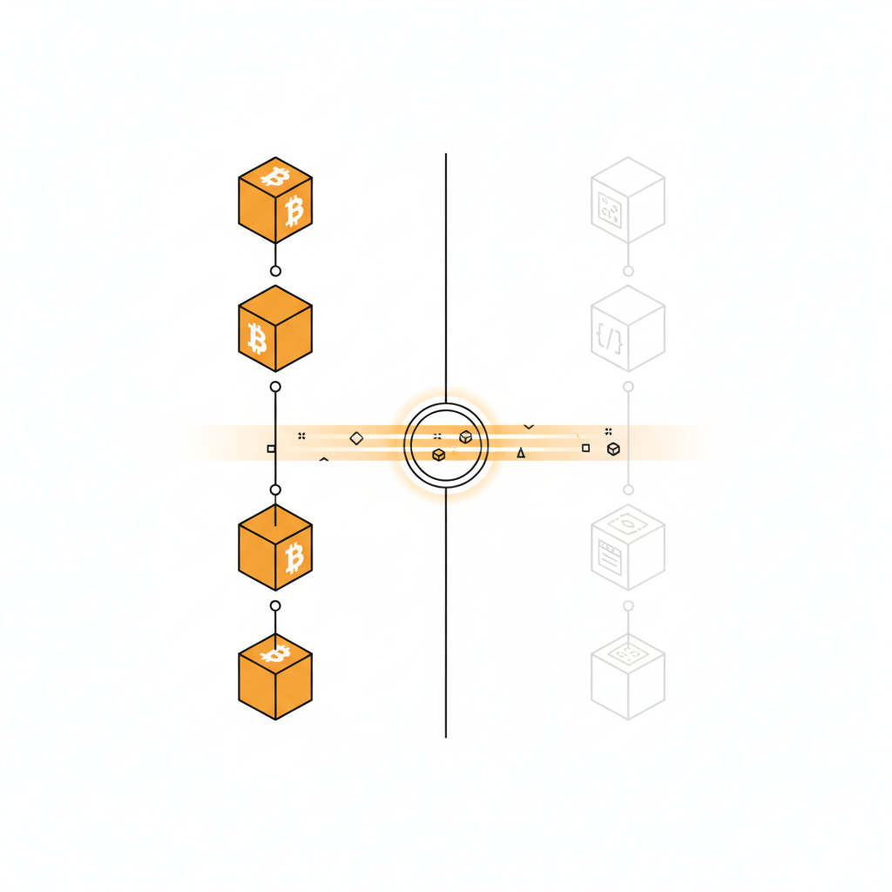
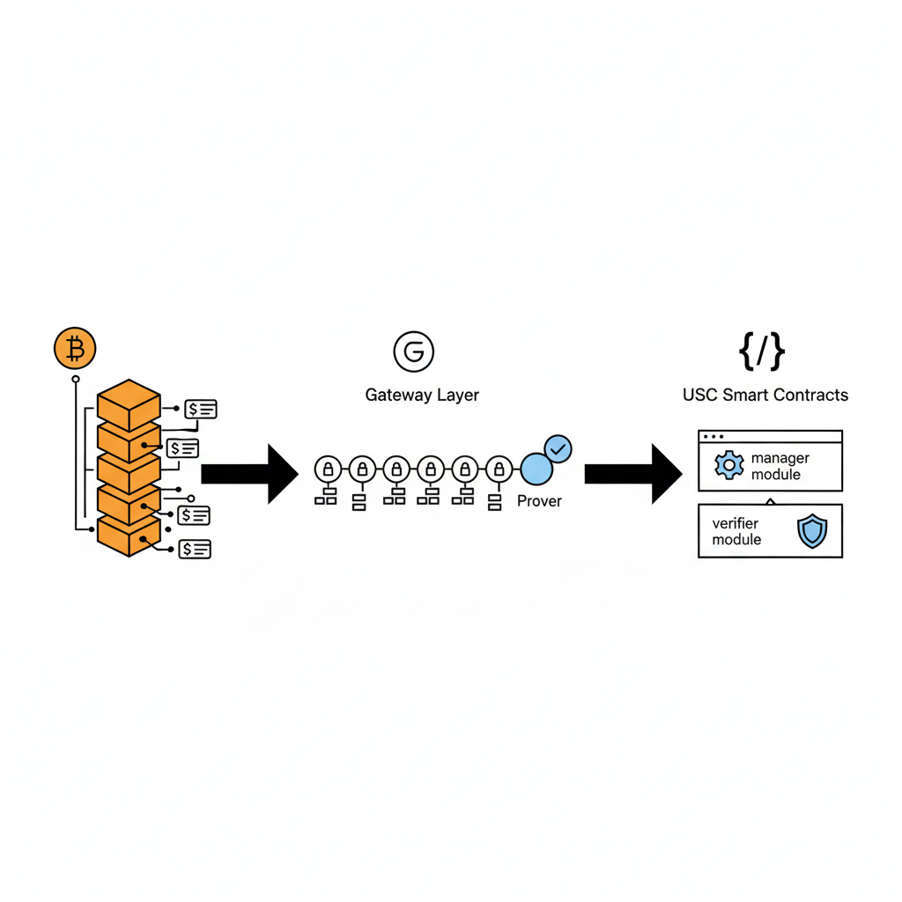
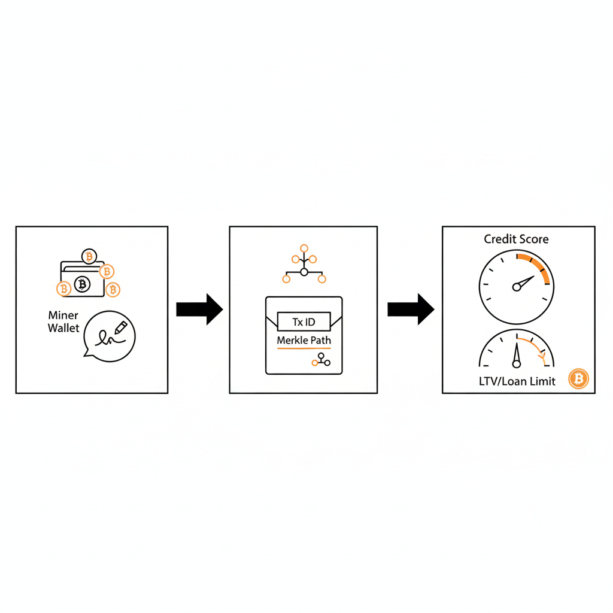
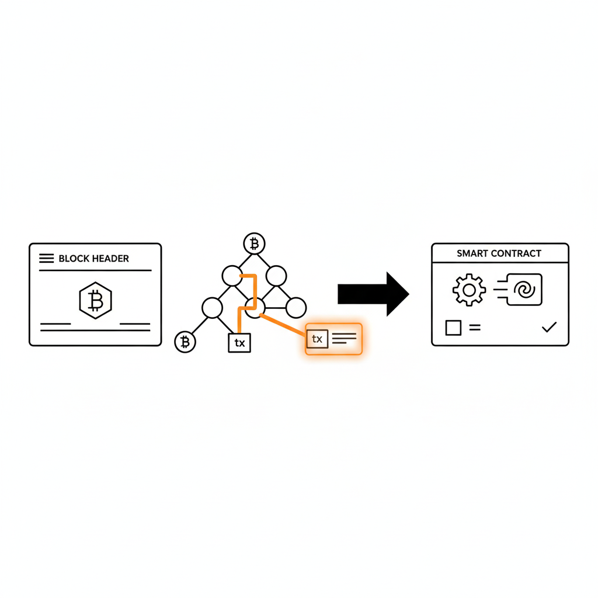
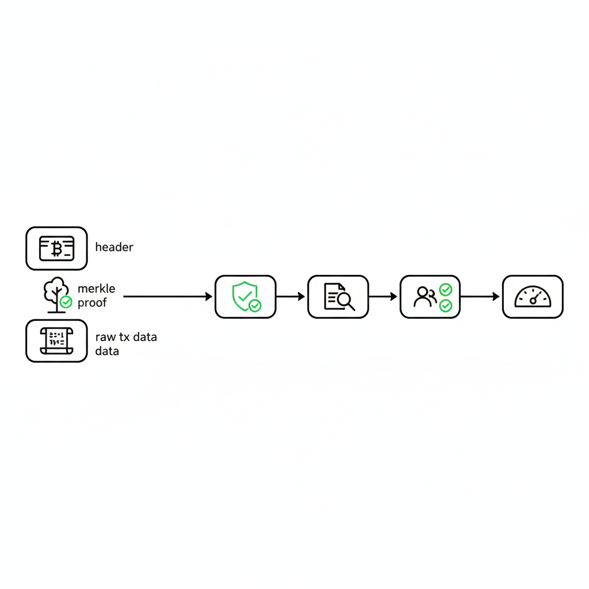
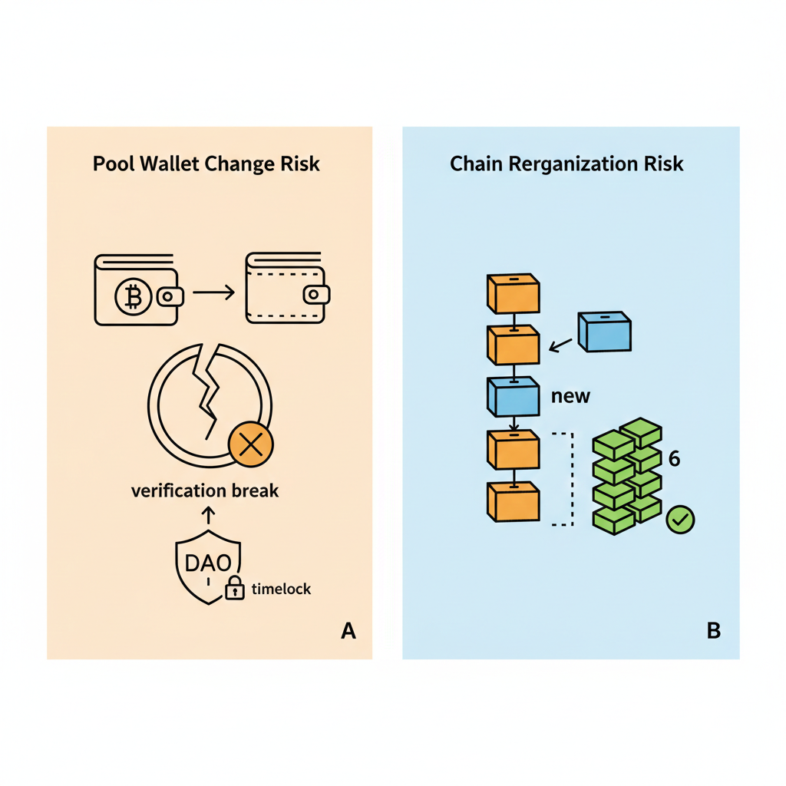
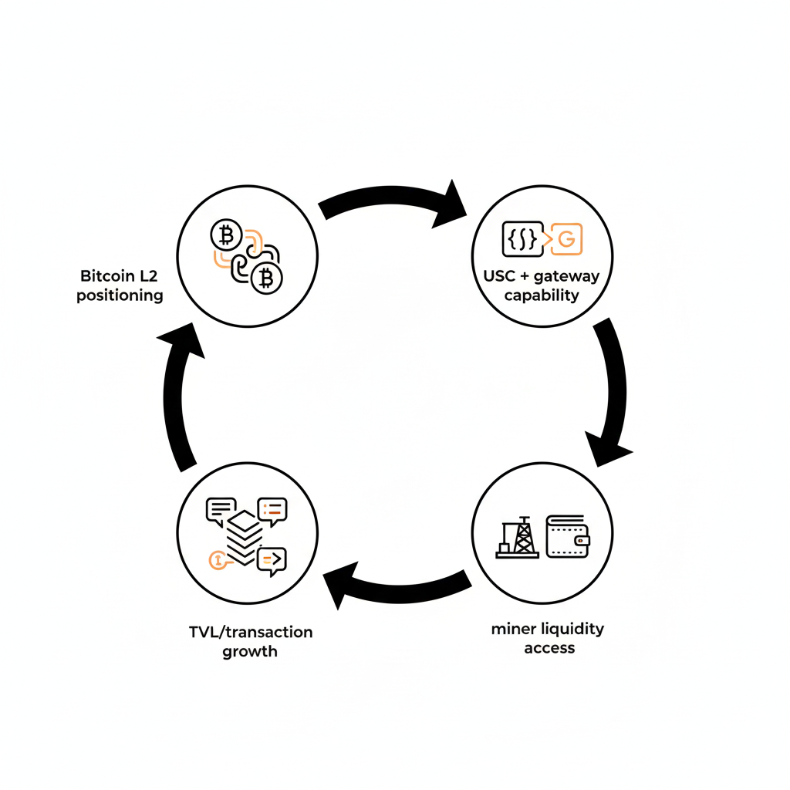

# HashCredit — Bitcoin Hashrate-Backed Lending Protocol

> HashCredit is a decentralized lending protocol that tokenizes "Proof of Work" itself. By leveraging Creditcoin's Universal Smart Contract (USC) technology, HashCredit verifies Bitcoin mining revenues (hashrate) without physical collateral or centralized oracles. We aim to establish Creditcoin as the premier "Bitcoin L2" for financial liquidity in the mining sector.



## Table of contents

- [Problem statement](#problem-statement)
- [Solution overview](#solution-overview)
- [Technical architecture](#technical-architecture)
- [Verification workflow ("deep tech")](#verification-workflow-deep-tech)
- [Smart contract specs (pseudo-code)](#smart-contract-specs-pseudo-code)
- [Risk management](#risk-management)
- [Strategic fit for Creditcoin](#strategic-fit-for-creditcoin)

## Problem statement

### The "Rich Miner, Poor Cash" paradox



- **Capital inefficiency:** Bitcoin miners possess expensive hardware (ASICs) and generate consistent cash flow, but they suffer from liquidity crunches due to OPEX (electricity, maintenance).
- **Collateral friction:** Traditional lenders require physical custody of ASICs or extensive off-chain due diligence, which is slow and geographically limited.
- **Missing on-chain primitive:** While RWA (Real World Assets) is a trending narrative, "Future Hashrate" remains an untapped asset class in DeFi because it is difficult to verify on-chain in a trustless manner.

## Solution overview



### Trustless revenue-based financing (RBF)

HashCredit introduces a mechanism to underwrite loans based on a miner's verified on-chain revenue stream.

- **No bridging required:** We do not bridge BTC. We read the Bitcoin state directly via Creditcoin.
- **Oracle-less verification:** Instead of relying on centralized price feeds (e.g., Chainlink), we utilize Creditcoin's Gateway Technology (SPV) to mathematically prove income.



## Technical architecture

The architecture consists of three layers leveraging the Creditcoin 3.0 stack:

```text
Bitcoin Network (Source) -> Creditcoin Gateway (Bridge) -> USC Contracts (Logic)
```



### A. The source (Bitcoin network)

- **Data points:** mining pool payout transactions (standard BTC transactions).
- **Why pool payouts?** 99% of miners operate via pools (e.g., AntPool, Foundry). Validating "coinbase transactions" restricts the market to solo miners. We target the mass market by validating payout flows from known pool wallets.


### B. The bridge (Creditcoin Gateway)

- **Attestors:** specialized nodes that monitor the Bitcoin mainnet and sync block headers to the Creditcoin chain. They provide the "root of trust."
- **Provers:** off-chain agents (or the miners themselves) that submit cryptographic proofs (SPV) claiming: "I received 0.5 BTC from AntPool in block #820,000."

### C. The logic (USC on Creditcoin)

- **HashCredit manager contract:** handles user registration, credit scoring, and lending logic.
- **SPV verifier:** a library contract that verifies the Merkle proof against the attestor's block headers.

## Verification workflow ("deep tech")



How we turn "Bitcoin blocks" into "credit scores" without a middleman.

### Phase 1: Identity & binding

- **Registration:** miner registers their BTC address (`btc_addr`) on the HashCredit dApp.
- **Ownership proof:** miner signs a message or sends a dust transaction from `btc_addr` to prove ownership.

### Phase 2: Trustless data ingestion

- **Payout detection:** the miner receives a payout from a whitelisted mining pool (e.g., Foundry USA).
- **Proof submission:** the miner submits the transaction ID and Merkle path to the HashCredit USC.

**On-chain verification**

1. The USC fetches the block header stored by Creditcoin attestors.
2. It computes the Merkle root using the submitted Merkle path.
3. Logic: `assert(ComputedRoot == StoredBlockHeader.MerkleRoot)`



**Result:** the payout is cryptographically verified as valid without any third-party API.

### Phase 3: Hashrate estimation & scoring

Once the payout volume is verified, the contract calculates the implied hashrate:

$$
\text{Est. Hashrate} = \frac{\text{Verified Payout (BTC)} \times \text{Network Difficulty}}{\text{Block Reward} \times \text{Time Delta}}
$$

- **LTV calculation:** the loan limit is set dynamically based on the 30-day moving average of the estimated hashrate.

## Smart contract specs (pseudo-code)

```solidity
// Core Logic for HashCredit USC
contract HashCreditVerifier {
    // Whitelisted addresses of major mining pools (Governed by DAO)
    mapping(address => bool) public isMiningPool;

    struct MinerCredit {
        uint256 totalVerifiedPayout;
        uint256 lastPayoutBlock;
        uint256 estimatedHashrate; // EH/s
    }

    // The "Magic" Function
    function submitProof(
        bytes calldata _header,
        bytes calldata _merkleProof,
        bytes calldata _rawTx
    ) external {
        // 1. Verify that the block header is recognized by Creditcoin Attestors
        require(Gateway.isBlockConfirmed(_header), "Block not confirmed");

        // 2. Verify Merkle Proof (SPV)
        bytes32 txHash = sha256(sha256(_rawTx));
        require(
            MerkleProof.verify(_header.merkleRoot, _merkleProof, txHash),
            "Invalid SPV Proof"
        );

        // 3. Parse Bitcoin Transaction
        BitcoinTx memory tx = BitcoinParser.parse(_rawTx);

        // 4. Validate Sender (Must be a known Pool) & Receiver (Must be the User)
        require(isMiningPool[tx.inputs[0].sender], "Source is not a verified pool");
        require(tx.outputs[0].receiver == msg.sender.btcAddress, "Not the owner");

        // 5. Update Credit Score
        _updateHashrateModel(msg.sender, tx.outputs[0].amount);
    }
}
```



## Risk management



### A. Pool centralization risk

- **Risk:** a mining pool might rotate its hot wallet address, causing verification failures.
- **Mitigation:** implement a "pool registry oracle" managed by the DAO. Since pool wallet addresses are public knowledge in the explorer ecosystem, updates can be proposed and executed with a 24-hour timelock.

### B. Reorg attacks

- **Risk:** a Bitcoin block reorg invalidates a payout transaction.
- **Mitigation:** require a confirmation depth of 6 blocks (~1 hour) on the Bitcoin mainnet before accepting any SPV proof.

## Strategic fit for Creditcoin



Why this project?

- **Showcase for USC:** a strong demonstration of Creditcoin 3.0’s capability to read Bitcoin state without bridging. It validates the "Gateway" thesis.
- **TVL & real yield:** mining is a multi-billion dollar industry. Bringing even 1% of this liquidity creates massive TVL and transaction volume for CTC.
- **Bitcoin L2 narrative:** by offering financial services directly tied to Bitcoin's security (hashrate), Creditcoin cements its position as a true Bitcoin infrastructure layer.
